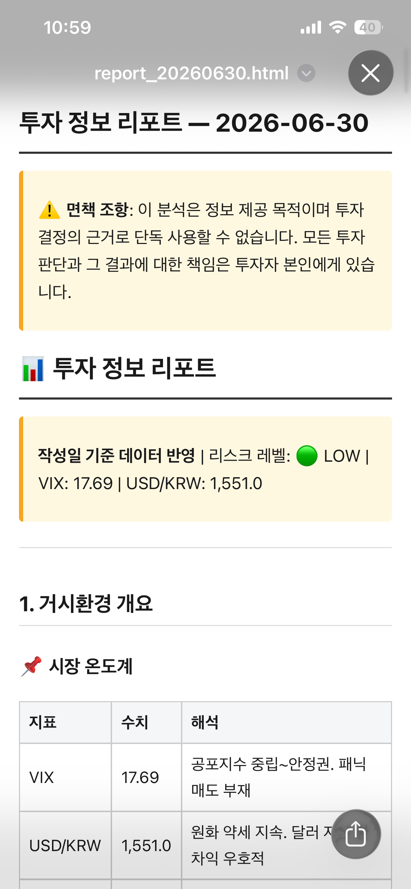

# InvestmentAgent


[](LICENSE)
-8A2BE2)


멀티 에이전트 기반 투자 정보 수집·분석 시스템.
다중 데이터 수집 → 섹터 분류 → 종목 선별 → 차트 분석 → 상승여력 검증 → 리포트 생성까지
자동화된 파이프라인을 구성한다.

> **핵심 목표:** 투자 결정을 대신하는 게 아니라, 선행 지표 데이터를 축적해
> 장기적으로 적중률 높은 패턴을 발견하는 것.

> ⚠️ **면책:** 이 프로젝트의 모든 분석 결과는 정보 제공 목적이며,
> 투자 결정의 근거로 단독 사용할 수 없습니다.

---

## 파이프라인 (Agent 0 → 9)

| # | 에이전트 | 역할 |
|---|----------|------|
| 0 | MacroCheck | VIX·금리·환율로 시장 리스크 레벨(LOW/MID/HIGH) 판정 |
| 1 | DataQuality | 수집 소스 게이트 (중복·오래된 기사 필터) |
| 2 | DataCollector | 뉴스 수집 → Haiku로 감성 점수(-1.0~1.0) 수치화 → RAG 저장 |
| 3 | SectorClassifier | 뉴스 감성 가중으로 핫섹터 선정 + **관심 섹터** 항상 포함 |
| 4 | PortfolioContext | `portfolio.json` 보유종목/비중 반영, 과대비중 섹터 플래그 |
| 5 | StockScreener | 핫섹터에서 후보 종목 추출, 과대비중·보유 종목 제외 |
| 6 | ChartAnalyzer | RSI/MACD/이평선 계산 + **선행지표**(EPS/내부자/공매도/구글트렌드) 수집 |
| 7 | ThesisValidator | Bull/Bear case 생성 (Bear는 컨텍스트 격리로 진짜 반론 강제) |
| 8 | ReportGenerator | 리포트 작성 + 면책 강제 삽입 + 텔레그램 발송 |
| 9 | FeedbackTracker | 예측 이력 저장 + 5일/20일 후 가격·수익률 자동 추적 |

자세한 설계는 [`CLAUDE.md`](./CLAUDE.md) 참고.

---

## 설치

```bash
# 1. 의존성
pip install -r requirements.txt

# 2. 환경변수
cp .env.example .env
#   → .env 에 ANTHROPIC_API_KEY (필수), 텔레그램 토큰 등 입력

# 3. 포트폴리오
cp portfolio.sample.json portfolio.json
#   → portfolio.json 에 실제 보유 종목 입력
```

> `.env` 와 `portfolio.json` 은 `.gitignore` 로 제외되어 **절대 커밋되지 않습니다.**

---

## 실행

```bash
# 즉시 1회 실행 (테스트)
python scheduler.py --now

# 스케줄러 + 텔레그램 봇 시작
#   - 매일 07:00 (Asia/Seoul) 자동 실행
#   - 텔레그램 /run 명령으로 즉시 실행
python scheduler.py
```

리포트는 `reports/report_YYYYMMDD.md` (+ 폰용 `.html`) 로 저장되고,
텔레그램으로 요약 + 파일이 발송된다.

---

## 실행 결과 예시

아래는 실제 1회 실행(`python scheduler.py --now`) 결과다.
관심 섹터 `Energy,Industrials` + `HOT_SECTOR_COUNT=1` + `MAX_CANDIDATES_PER_SECTOR=3` 설정.

<p align="center">
  
  <br>
  <em>폰에서 본 HTML 리포트 (텔레그램으로 자동 발송됨)</em>
</p>

### 파이프라인 로그 (요약)

```
[Agent 0] MacroCheck      VIX=17.69 USDKRW=1551.0 US10Y=4.39 -> risk=LOW
[Agent 2] DataCollector   기사 98건 -> 중복제거 -> 최근 78건 처리(감성 점수화)
[Agent 3] SectorClassifier 뉴스 핫섹터: Healthcare | 관심섹터 추가: Energy, Industrials
[Agent 4] PortfolioContext 보유 6종목 -> 과대비중: Semiconductors(47%), Technology(42%)
[Agent 5] StockScreener   후보 9종목 선별 (제안 18 → 섹터당 3)
[Agent 6] ChartAnalyzer   후보 9 + 보유 6 차트·선행지표 수집
[Agent 7] ThesisValidator Bull/Bear 검증 (종목별 verdict 산출)
[Agent 8] ReportGenerator 리포트 저장 + 텔레그램 발송 성공
[Agent 9] FeedbackTracker 예측 15건 저장(후보 9+보유 6), 후속가격 12건 갱신
토큰 비용: 124회 호출, 합계 $0.4485 (Haiku $0.11 + Sonnet $0.33)
```

> 과대비중 섹터(Semiconductors·Technology)는 신규 후보 없이 **보유 종목 모니터링만** 되고,
> 발굴은 관심 섹터(Energy·Industrials) + 뉴스 핫섹터(Healthcare)에서 일어난다.

### 종목별 판정 (9종목)

| 섹터 | 종목 | 판정 | 확신도 |
|------|------|------|--------|
| Healthcare | JNJ / UNH / PFE | NEUTRAL / NEUTRAL / **BEARISH** | 52 / 52 / 72 |
| Energy | XOM / CVX / COP | BEARISH / BEARISH / BEARISH | 62 / 62 / 62 |
| Industrials | BA / CAT / GE | BEARISH / **BULLISH** / **BULLISH** | 65 / 62 / 62 |

### 텔레그램 발송 메시지

```
[투자 리포트] 2026-06-30

📊 오늘의 핫섹터: Healthcare, Energy, Industrials
🔍 분석 종목: JNJ, UNH, PFE, XOM, CVX, COP, BA, CAT, GE
⚠️ 시장 리스크: LOW

상위 추천:
• CAT — bullish (confidence 62)
• GE — bullish (confidence 62)
• PFE — bearish (confidence 72)

전체 리포트: reports/report_20260630.md

⚠️ 이 분석은 정보 제공 목적이며 투자 결정의 근거로 단독 사용 불가
```

### 리포트 본문 발췌 — Caterpillar (CAT), 최선호 종목

```
판정: 🟢 BULLISH | 확신도: 62% | 현재가: $1,049.55

기술적 지표        RSI 63.95 | MACD Bullish | MA20·MA60 동시 상회(+9.7% / +18.8%)
선행지표          EPS +30.52% | 내부자 0/0 | 공매도 3.01%(Δ+1.09%)

💚 강세: EPS·MACD·이중 정배열 삼박자 일치, 인프라 투자 사이클 수혜
🔴 약세: 공매도 소폭 증가, 중국 부동산 침체 아시아 매출 압박
📋 종합: 선행·기술 지표가 가장 일관되게 긍정적. 분할 매수 또는 $980~1,000 조정 시 추가 매수 권장
```

> 전체 리포트는 종목별 기술적 지표·선행지표 표 + Bull/Bear 논거 + 종합 판단을 포함한다
> (거시환경·핫섹터 개요 + 9종목 상세, 약 400줄).

---

## 주요 설정 (`.env`)

| 변수 | 기본값 | 설명 |
|------|--------|------|
| `ANTHROPIC_API_KEY` | — | **필수.** Claude API 키 |
| `NEWSAPI_KEY` | — | 선택. 없으면 RSS만 사용 |
| `PREFERRED_SECTORS` | `Energy,Industrials` | 관심 섹터(콤마 구분). 뉴스와 무관하게 항상 분석 |
| `HOT_SECTOR_COUNT` | `3` | 그날 뉴스로 뽑는 핫섹터 개수 (관심 섹터에 더해짐) |
| `MAX_CANDIDATES_PER_SECTOR` | `5` | 섹터당 후보 종목 수 |
| `PORTFOLIO_OVERWEIGHT_THRESHOLD` | `0.30` | 섹터 비중이 이 값 이상이면 과대비중 → 신규 후보 제외 |
| `NOTIFICATION_CHANNEL` | `none` | `telegram` \| `gmail` \| `none` |
| `SCHEDULE_HOUR` / `SCHEDULE_MINUTE` | `7` / `0` | 매일 자동 실행 시각 |

> **관심 섹터 동작:** 분석 섹터 = `관심 섹터(고정) + 뉴스 핫섹터(HOT_SECTOR_COUNT개)`.
> 보유·과대비중 섹터는 신규 후보 없이 모니터링만 되고, 발굴은 비보유 관심 섹터에서 일어난다.

전체 설정은 [`config.py`](./config.py) 참고.

---

## 텔레그램 봇 설정

1. 텔레그램에서 `@BotFather` → `/newbot` 으로 봇 생성 → **BOT_TOKEN** 발급
2. 봇과 대화 시작 후 `@userinfobot` 으로 본인 **CHAT_ID** 확인
3. `.env` 에 `TELEGRAM_BOT_TOKEN`, `TELEGRAM_CHAT_ID`, `NOTIFICATION_CHANNEL=telegram` 입력

---

## 기술 스택

- **LLM:** Claude (Haiku 4.5 — 분류/감성/요약, Sonnet 4.6 — 차트해석/Bull·Bear/리포트)
- **데이터:** yfinance (주가·재무·내부자·공매도), pytrends (구글 트렌드), feedparser/NewsAPI (뉴스)
- **저장:** SQLite (예측 이력) + ChromaDB (뉴스 RAG, 내장 임베딩)
- **스케줄:** APScheduler / **알림:** 텔레그램 Bot API (requests), Gmail (smtplib)

---

## 면책

이 소프트웨어는 정보 제공 및 데이터 축적 목적입니다.
산출되는 모든 분석·예측은 투자 권유나 자문이 아니며,
투자 결정과 그 결과에 대한 책임은 전적으로 사용자에게 있습니다.

---

## 라이선스

[MIT License](LICENSE) © 2026 박재현 (Park Jaehyun)
